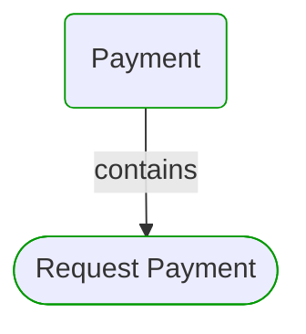
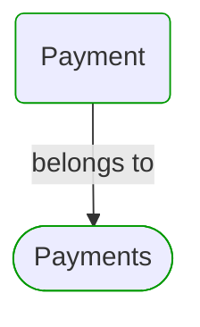
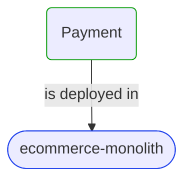


# Payment

***Process***  

This view contains details information about Payment business process, including:
- use cases
- related domain modules
- related deployable units
- engaged people: actors, development teams, business stakeholders  

---

## Domain Perspective

### Related use cases

### Related top level domain modules

## Technology Perspective

### Related deployable units

## People Perspective

### Engaged people

No engaged people were found.  

## Next use cases

### Zoom-in

#### Domain perspective

##### Use Cases

[Request Payment](../Modules/Payments/Requesting/RequestPayment.md)  

#### Technology perspective

##### Deployable Units

[ecommerce-monolith](../../Technology/DeployableUnits/EcommerceMonolith.md)  

### Zoom-out

#### Domain perspective

[Business Processes](BusinessProcesses.md)  

---

[P3 Model](https://github.com/P3-model/P3-model) documentation generated from source code using [.net tooling](https://github.com/P3-model/P3-model-dotnet)