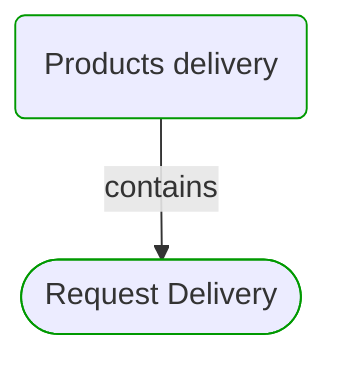
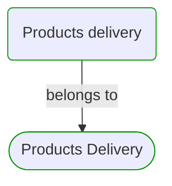
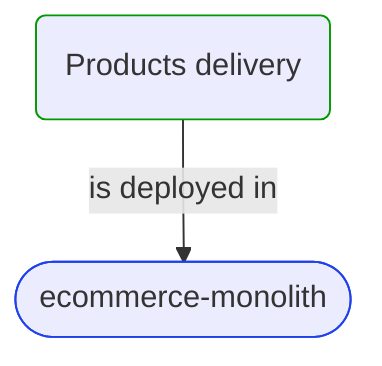
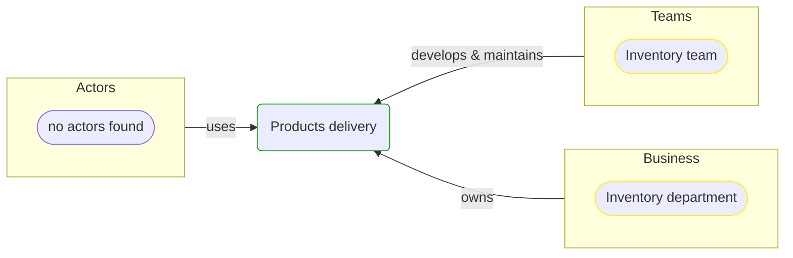

# Products delivery

***Process***  

This view contains details information about Products delivery business process, including:
- process steps
- related domain modules
- related deployable units
- engaged people: actors, development teams, business stakeholders  

---

## Domain Perspective

### Related process steps

### Related top level domain modules

## Technology Perspective

### Related deployable units

## People Perspective

### Engaged people

## Next steps

### Zoom-in

#### Domain perspective

##### Process Steps

[Request Delivery](../Concepts/ProductsDelivery/Requesting/RequestDelivery.md)  

#### Technology perspective

##### Deployable Units

[ecommerce-monolith](../../Technology/DeployableUnits/EcommerceMonolith.md)  

#### People perspective

##### Business Organizational Units

[Inventory department](../../People/BusinessOrganizationalUnits/InventoryDepartment.md)  

##### Development Teams

[Inventory team](../../People/DevelopmentTeams/InventoryTeam.md)  

### Zoom-out

#### Domain perspective

[Business Processes](BusinessProcesses.md)  

---

[P3 Model](https://github.com/P3-model/P3-model) documentation generated from source code using [.net tooling](https://github.com/P3-model/P3-model-dotnet)