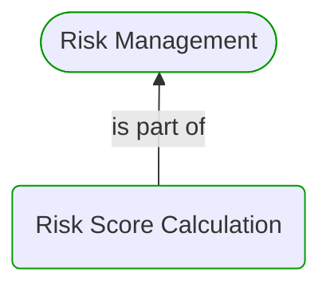

# Risk Score Calculation

***Process***  

This view contains details information about Risk Score Calculation business process, including:
- other related processes
- process steps
- related domain modules
- related deployable units
- engaged people: actors, development teams, business stakeholders  

---

## Domain Perspective

### Related processes and steps

### Related domain modules

No related domain modules were found.  

## Technology Perspective

### Related deployable units

No related deployable units were found.  

## People Perspective

### Engaged people

No engaged people were found.  

## Next steps

### Zoom-out

#### Domain perspective

[Business Processes](../../BusinessProcesses.md)  

---

[P3 Model](https://github.com/P3-model/P3-model) documentation generated from source code using [.net tooling](https://github.com/P3-model/P3-model-dotnet)