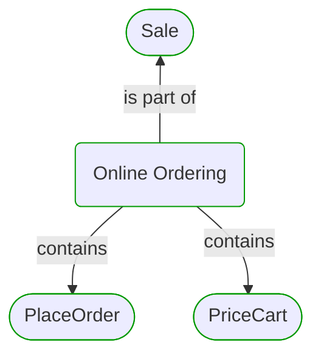
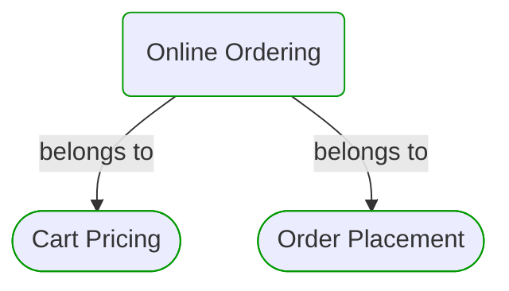
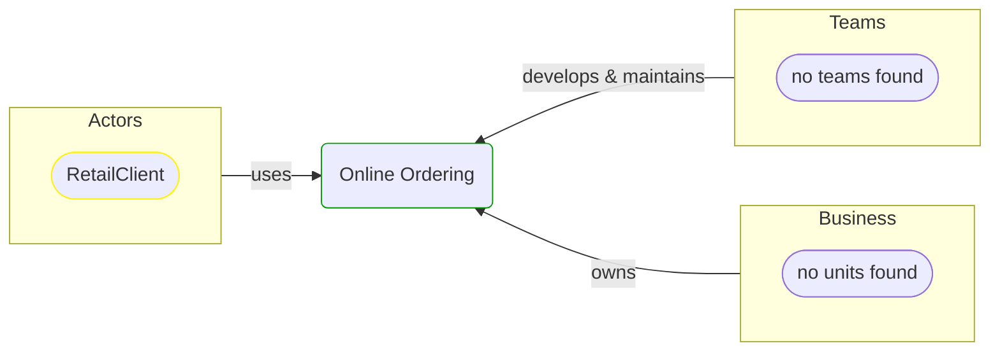


# Online Ordering

***Process***  

This view contains details information about Online Ordering business process, including:
- other related processes
- process steps
- related domain modules
- related deployable units
- engaged people: actors, development teams, business stakeholders  

---

## Domain Perspective

### Related processes and steps

### Related domain modules

## Technology Perspective

### Related deployable units

No related deployable units were found.  

## People Perspective

### Engaged people

## Next steps

### Zoom-in

#### Domain perspective

##### Process Steps

[PlaceOrder](../../../Concepts/Sales/OnlineOrdering/OrderPlacement/PlaceOrder.md)  
[PriceCart](../../../Concepts/Sales/OnlineOrdering/CartPricing/PriceCart.md)  

### Zoom-out

#### Domain perspective

[Business Processes](../../BusinessProcesses.md)  

---

[P3 Model](https://github.com/P3-model/P3-model) documentation generated from source code using [.net tooling](https://github.com/P3-model/P3-model-dotnet)