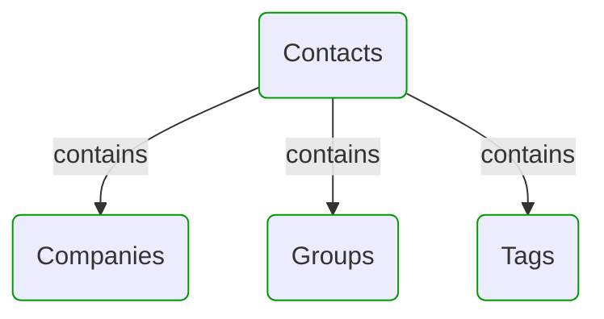
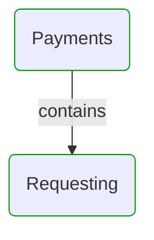
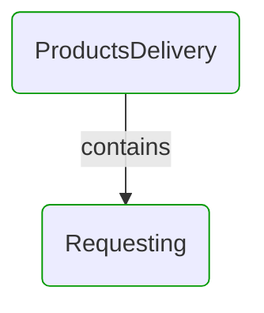
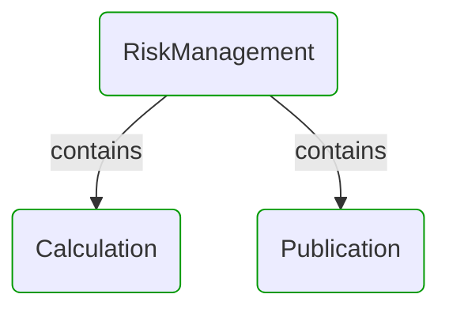


# Domain Modules

This view shows domain model modularization.  
First level modules can be treated as separate sub-models or DDD Bounded Contexts.  
All modules can be divided into sub-modules to reflect hierarchical structure of the domain.  

---

## Modules hierarchy

## Contacts

## Payments

## ProductsDelivery

## RiskManagement

## Sales

```mermaid
  flowchart TB
    0(Sales)
    class 0 DomainPerspective
    1(Clients)
    class 1 DomainPerspective
    0-->|contains|1
    2(Commons)
    class 2 DomainPerspective
    0-->|contains|2
    3(ExchangeRates)
    class 3 DomainPerspective
    0-->|contains|3
    4(Fulfillment)
    class 4 DomainPerspective
    0-->|contains|4
    5(Integrations)
    class 5 DomainPerspective
    0-->|contains|5
    6(Payments)
    class 6 DomainPerspective
    5-->|contains|6
    7(ProductsDelivery)
    class 7 DomainPerspective
    5-->|contains|7
    8(RiskManagement)
    class 8 DomainPerspective
    5-->|contains|8
    9(OnlineOrdering)
    class 9 DomainPerspective
    0-->|contains|9
    10(CartPricing)
    class 10 DomainPerspective
    9-->|contains|10
    11(OrderPlacement)
    class 11 DomainPerspective
    9-->|contains|11
    12(Orders)
    class 12 DomainPerspective
    0-->|contains|12
    13(PriceChanges)
    class 13 DomainPerspective
    12-->|contains|13
    14(Pricing)
    class 14 DomainPerspective
    0-->|contains|14
    15(Discounts)
    class 15 DomainPerspective
    14-->|contains|15
    16(PriceLists)
    class 16 DomainPerspective
    14-->|contains|16
    17(SpecialOffers)
    class 17 DomainPerspective
    14-->|contains|17
    18(Products)
    class 18 DomainPerspective
    0-->|contains|18
    19(SalesChannels)
    class 19 DomainPerspective
    0-->|contains|19
    20(Time)
    class 20 DomainPerspective
    0-->|contains|20
    21(WholesaleOrdering)
    class 21 DomainPerspective
    0-->|contains|21
    22(OrderCreation)
    class 22 DomainPerspective
    21-->|contains|22
    23(OrderModification)
    class 23 DomainPerspective
    21-->|contains|23
    24(OrderPlacement)
    class 24 DomainPerspective
    21-->|contains|24
    25(OrderPricing)
    class 25 DomainPerspective
    21-->|contains|25
    26(ProductPricing)
    class 26 DomainPerspective
    21-->|contains|26
    classDef DomainPerspective stroke:#009900
    classDef TechnologyPerspective stroke:#1F41EB
    classDef PeoplePerspective stroke:#FFF014
```

## Next steps

### Zoom-in

- [[*Domain module*] Contacts](Modules/Contacts/Contacts.md)
  - [[*Domain module*] Companies](Modules/Contacts/Companies/Companies.md)
  - [[*Domain module*] Groups](Modules/Contacts/Groups/Groups.md)
  - [[*Domain module*] Tags](Modules/Contacts/Tags/Tags.md)
- [[*Domain module*] Payments](Modules/Payments/Payments.md)
  - [[*Domain module*] Requesting](Modules/Payments/Requesting/Requesting.md)
- [[*Domain module*] ProductsDelivery](Modules/ProductsDelivery/ProductsDelivery.md)
  - [[*Domain module*] Requesting](Modules/ProductsDelivery/Requesting/Requesting.md)
- [[*Domain module*] RiskManagement](Modules/RiskManagement/RiskManagement.md)
  - [[*Domain module*] Calculation](Modules/RiskManagement/Calculation/Calculation.md)
  - [[*Domain module*] Publication](Modules/RiskManagement/Publication/Publication.md)
- [[*Domain module*] Sales](Modules/Sales/Sales.md)
  - [[*Domain module*] Clients](Modules/Sales/Clients/Clients.md)
  - [[*Domain module*] Commons](Modules/Sales/Commons/Commons.md)
  - [[*Domain module*] ExchangeRates](Modules/Sales/ExchangeRates/ExchangeRates.md)
  - [[*Domain module*] Fulfillment](Modules/Sales/Fulfillment/Fulfillment.md)
  - [[*Domain module*] Integrations](Modules/Sales/Integrations/Integrations.md)
    - [[*Domain module*] Payments](Modules/Sales/Integrations/Payments/Payments.md)
    - [[*Domain module*] ProductsDelivery](Modules/Sales/Integrations/ProductsDelivery/ProductsDelivery.md)
    - [[*Domain module*] RiskManagement](Modules/Sales/Integrations/RiskManagement/RiskManagement.md)
  - [[*Domain module*] OnlineOrdering](Modules/Sales/OnlineOrdering/OnlineOrdering.md)
    - [[*Domain module*] CartPricing](Modules/Sales/OnlineOrdering/CartPricing/CartPricing.md)
    - [[*Domain module*] OrderPlacement](Modules/Sales/OnlineOrdering/OrderPlacement/OrderPlacement.md)
  - [[*Domain module*] Orders](Modules/Sales/Orders/Orders.md)
    - [[*Domain module*] PriceChanges](Modules/Sales/Orders/PriceChanges/PriceChanges.md)
  - [[*Domain module*] Pricing](Modules/Sales/Pricing/Pricing.md)
    - [[*Domain module*] Discounts](Modules/Sales/Pricing/Discounts/Discounts.md)
    - [[*Domain module*] PriceLists](Modules/Sales/Pricing/PriceLists/PriceLists.md)
    - [[*Domain module*] SpecialOffers](Modules/Sales/Pricing/SpecialOffers/SpecialOffers.md)
  - [[*Domain module*] Products](Modules/Sales/Products/Products.md)
  - [[*Domain module*] SalesChannels](Modules/Sales/SalesChannels/SalesChannels.md)
  - [[*Domain module*] Time](Modules/Sales/Time/Time.md)
  - [[*Domain module*] WholesaleOrdering](Modules/Sales/WholesaleOrdering/WholesaleOrdering.md)
    - [[*Domain module*] OrderCreation](Modules/Sales/WholesaleOrdering/OrderCreation/OrderCreation.md)
    - [[*Domain module*] OrderModification](Modules/Sales/WholesaleOrdering/OrderModification/OrderModification.md)
    - [[*Domain module*] OrderPlacement](Modules/Sales/WholesaleOrdering/OrderPlacement/OrderPlacement.md)
    - [[*Domain module*] OrderPricing](Modules/Sales/WholesaleOrdering/OrderPricing/OrderPricing.md)
    - [[*Domain module*] ProductPricing](Modules/Sales/WholesaleOrdering/ProductPricing/ProductPricing.md)

### Zoom-out

- [Main page](README.md)

---

[P3 Model](https://github.com/P3-model/P3-model) documentation generated from source code using [.net tooling](https://github.com/P3-model/P3-model-dotnet)