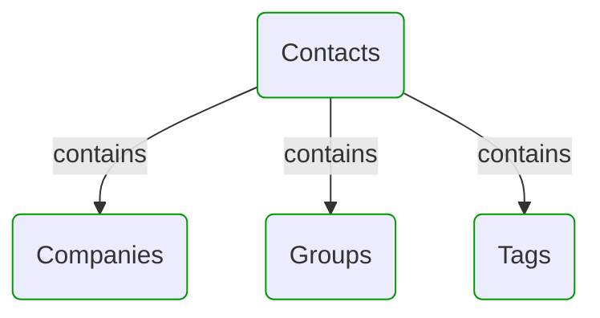
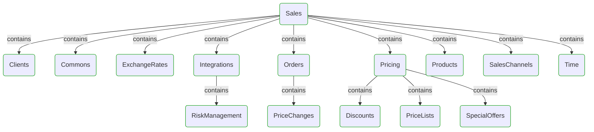


# Domain Modules

This view shows domain model modularization.  
First level modules can be treated as separate sub-models or DDD Bounded Contexts.  
All modules can be divided into sub-modules to reflect hierarchical structure of the domain.  

---

## Modules hierarchy

## Contacts

## Sales

## Next steps

### Zoom-in

#### Domain perspective

##### Domain modules

[Clients](Modules/Sales/Clients/Clients.md)  
[Commons](Modules/Sales/Commons/Commons.md)  
[Companies](Modules/Contacts/Companies/Companies.md)  
[Contacts](Modules/Contacts/Contacts.md)  
[Discounts](Modules/Sales/Pricing/Discounts/Discounts.md)  
[ExchangeRates](Modules/Sales/ExchangeRates/ExchangeRates.md)  
[Groups](Modules/Contacts/Groups/Groups.md)  
[Integrations](Modules/Sales/Integrations/Integrations.md)  
[Orders](Modules/Sales/Orders/Orders.md)  
[PriceChanges](Modules/Sales/Orders/PriceChanges/PriceChanges.md)  
[PriceLists](Modules/Sales/Pricing/PriceLists/PriceLists.md)  
[Pricing](Modules/Sales/Pricing/Pricing.md)  
[Products](Modules/Sales/Products/Products.md)  
[RiskManagement](Modules/Sales/Integrations/RiskManagement/RiskManagement.md)  
[Sales](Modules/Sales/Sales.md)  
[SalesChannels](Modules/Sales/SalesChannels/SalesChannels.md)  
[SpecialOffers](Modules/Sales/Pricing/SpecialOffers/SpecialOffers.md)  
[Tags](Modules/Contacts/Tags/Tags.md)  
[Time](Modules/Sales/Time/Time.md)  

### Zoom-out

#### Multi perspectives

##### Cross elements

[Main page](README.md)  

---

[P3 Model](https://github.com/P3-model/P3-model) documentation generated from source code using [.net tooling](https://github.com/P3-model/P3-model-dotnet)