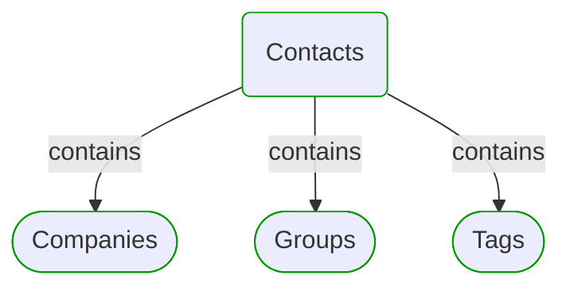
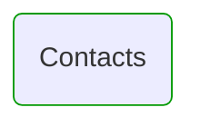
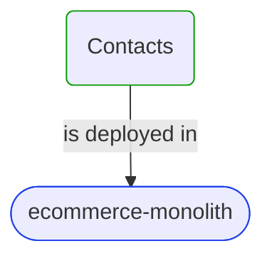


# Contacts

This view contains details information about Contacts domain module, including:
- other related modules
- related processes
- related building blocks
- related deployable units
- engaged people: actors, development teams, business stakeholders  

---

## Domain Perspective

### Related modules

### Related processes

### Direct building blocks

Module doesn't contain direct building blocks.  

## Technology Perspective

### Related deployable units

## People Perspective

### Engaged people

## Next steps

### Zoom-in

#### Domain perspective

##### Domain modules

[Companies](Companies/Companies.md)  
[Groups](Groups/Groups.md)  
[Tags](Tags/Tags.md)  

#### Technology perspective

##### Deployable units

[ecommerce-monolith](../../DeployableUnits/ecommerce-monolith.md)  

### Zoom-out

#### Domain perspective

##### Cross elements

[Domain Modules](../../Modules.md)  

---

[P3 Model](https://github.com/P3-model/P3-model) documentation generated from source code using [.net tooling](https://github.com/P3-model/P3-model-dotnet)