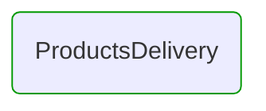

# [*Domain module*] ProductsDelivery

This view contains details information about ProductsDelivery domain module, including:
- other related modules
- related processes
- related building blocks
- related deployable units
- engaged people: actors, development teams, business stakeholders  

---

## Domain Perspective

### Related modules

### Related processes

### Direct building blocks

Module doesn't contain direct building blocks.  

## Technology Perspective

### Related deployable units

## People Perspective

### Engaged people

## Next steps

### Zoom-out

- [Business processes](../../Business_Processes.md)

### Change perspective

- [[*Deployable unit*] ecommerce-monolith](../../DeployableUnits/ecommerce-monolith.md)
- [[*Business organizational unit*] Inventory department](../../BusinessOrganizationalUnits/Inventory department.md)
- [[*Development team*] Inventory team](../../Teams/Inventory team.md)

---

[P3 Model](https://github.com/P3-model/P3-model) documentation generated from source code using [.net tooling](https://github.com/P3-model/P3-model-dotnet)