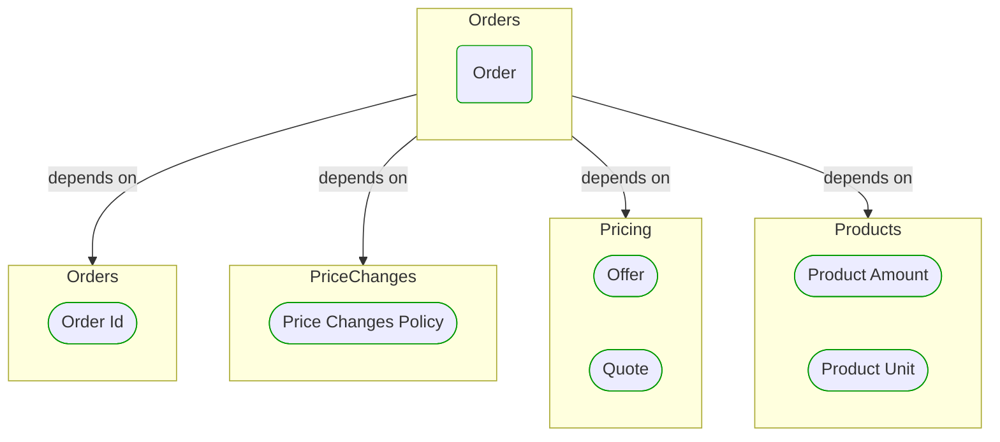
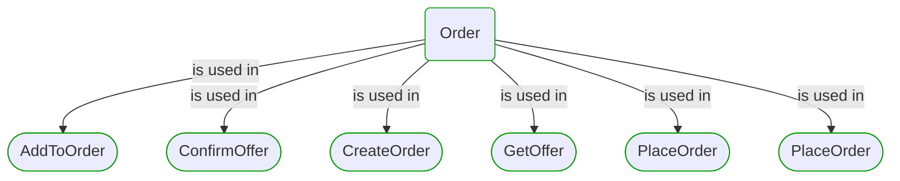


# Order

This view contains details information about Order building block, including:
- dependencies
- modules
- related processes  

---

## Domain Perspective

### Dependencies

### Related process steps

## Next steps

### Zoom-in

#### Domain perspective

##### Ddd domain services

[Price Changes Policy](PriceChanges/Price Changes Policy.md)  

##### Ddd value objects

[Offer](../Pricing/Offer.md)  
[Order Id](Order Id.md)  
[Product Amount](../Products/Product Amount.md)  
[Product Unit](../Products/Product Unit.md)  
[Quote](../Pricing/Quote.md)  

### Zoom-out

#### Domain perspective

##### Domain modules

[Orders](Orders.md)  

---

[P3 Model](https://github.com/P3-model/P3-model) documentation generated from source code using [.net tooling](https://github.com/P3-model/P3-model-dotnet)