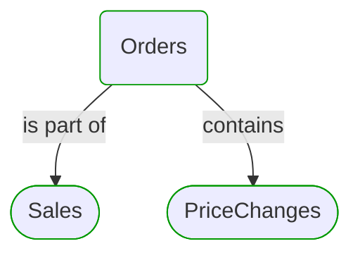
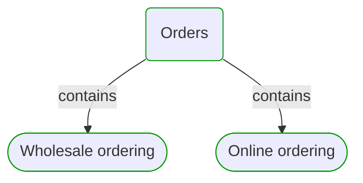
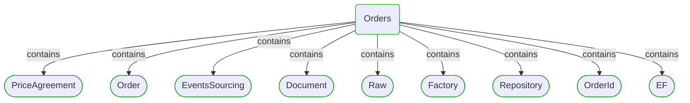
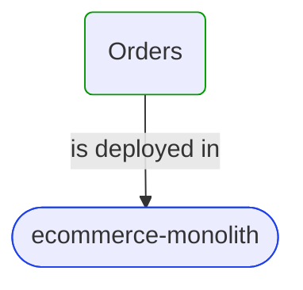
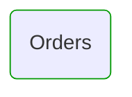


# [*Domain module*] Orders

This view contains details information about Orders domain module, including:
- other related modules
- related processes
- related building blocks
- related deployable units
- engaged people: actors, development teams, business stakeholders  

---

## Domain Perspective

### Related modules

### Related processes

### Direct building blocks

## Technology Perspective

### Related deployable units

## People Perspective

### Engaged people

## Next steps

### Zoom-out

- [Business processes](../../../Business_Processes.md)

### Change perspective

- [[*Deployable unit*] ecommerce-monolith](../../../DeployableUnits/ecommerce-monolith.md)
- [[*Domain building block*] Factory](../../../BuildingBlocks/Sales/Orders/Factory.md)
- [[*Domain building block*] EF](../../../BuildingBlocks/Sales/Orders/EF.md)
- [[*Domain building block*] PriceAgreement](../../../BuildingBlocks/Sales/Orders/PriceAgreement.md)
- [[*Domain building block*] Document](../../../BuildingBlocks/Sales/Orders/Document.md)
- [[*Domain building block*] EventsSourcing](../../../BuildingBlocks/Sales/Orders/EventsSourcing.md)
- [[*Domain building block*] Raw](../../../BuildingBlocks/Sales/Orders/Raw.md)
- [[*Domain building block*] OrderId](../../../BuildingBlocks/Sales/Orders/OrderId.md)
- [[*Domain building block*] Order](../../../BuildingBlocks/Sales/Orders/Order.md)
- [[*Domain building block*] Repository](../../../BuildingBlocks/Sales/Orders/Repository.md)
- [[*Business process*] Wholesale ordering](../../../Processes/Sale/Wholesale ordering/Wholesale ordering.md)
- [[*Business process*] Online ordering](../../../Processes/Sale/Online ordering/Online ordering.md)

---

[P3 Model](https://github.com/P3-model/P3-model) documentation generated from source code using [.net tooling](https://github.com/P3-model/P3-model-dotnet)