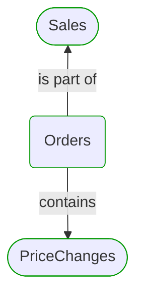
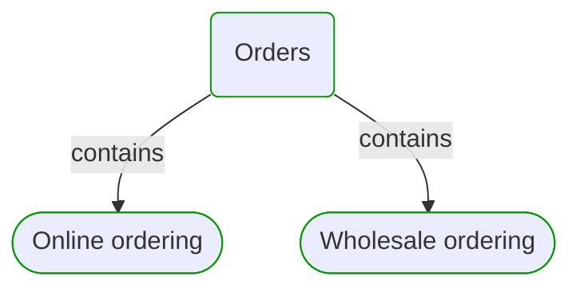
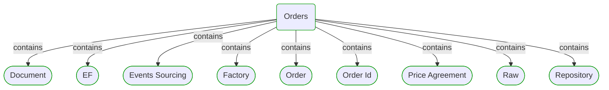
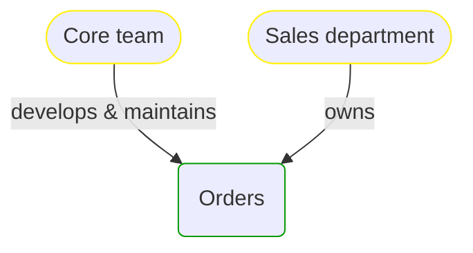


# Orders

This view contains details information about Orders domain module, including:
- other related modules
- related processes
- related building blocks
- related deployable units
- engaged people: actors, development teams, business stakeholders  

---

## Domain Perspective

### Related modules

### Related processes

### Direct building blocks

## Technology Perspective

### Related deployable units

## People Perspective

### Engaged people

## Next steps

### Zoom-in

#### Domain perspective

##### Ddd aggregates

[Order](Order.md)  

##### Ddd factories

[Factory](Factory.md)  

##### Ddd repositories

[Document](Document.md)  
[EF](EF.md)  
[Events Sourcing](Events Sourcing.md)  
[Raw](Raw.md)  
[Repository](Repository.md)  

##### Ddd value objects

[Order Id](Order Id.md)  
[Price Agreement](Price Agreement.md)  

##### Domain modules

[PriceChanges](PriceChanges/PriceChanges.md)  

##### Processes

[Online ordering](../../../Processes/Sale/Online ordering/Online ordering.md)  
[Wholesale ordering](../../../Processes/Sale/Wholesale ordering/Wholesale ordering.md)  

#### Technology perspective

##### Deployable units

[ecommerce-monolith](../../../DeployableUnits/ecommerce-monolith.md)  

#### People perspective

##### Business organizational units

[Sales department](../../../BusinessOrganizationalUnits/Sales department.md)  

##### Development teams

[Core team](../../../Teams/Core team.md)  

### Zoom-out

#### Domain perspective

##### Domain modules

[Sales](../Sales.md)  

---

[P3 Model](https://github.com/P3-model/P3-model) documentation generated from source code using [.net tooling](https://github.com/P3-model/P3-model-dotnet)