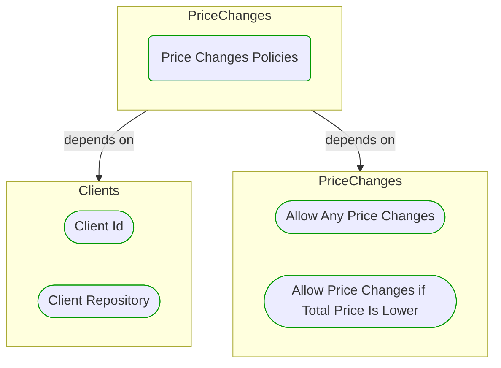
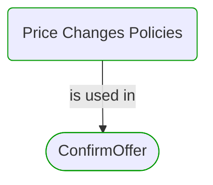


# Price Changes Policies

This view contains details information about Price Changes Policies building block, including:
- dependencies
- modules
- related processes  

---

## Domain Perspective

### Dependencies

### Related process steps

## Next steps

### Zoom-in

#### Domain perspective

##### Ddd domain services

[Allow Any Price Changes](Allow Any Price Changes.md)  
[Allow Price Changes if Total Price Is Lower](Allow Price Changes if Total Price Is Lower.md)  

##### Ddd repositories

[Client Repository](../../Clients/Client Repository.md)  

##### Ddd value objects

[Client Id](../../Clients/Client Id.md)  

### Zoom-out

#### Domain perspective

##### Domain modules

[PriceChanges](PriceChanges.md)  

---

[P3 Model](https://github.com/P3-model/P3-model) documentation generated from source code using [.net tooling](https://github.com/P3-model/P3-model-dotnet)