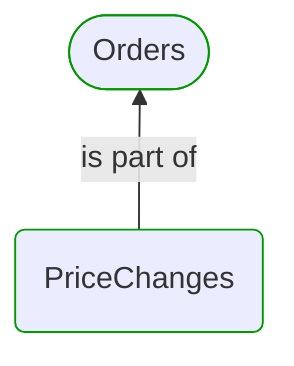

# PriceChanges

This view contains details information about PriceChanges domain module, including:
- other related modules
- related processes
- related building blocks
- related deployable units
- engaged people: actors, development teams, business stakeholders  

---

## Domain Perspective

### Related modules

### Related processes

### Direct building blocks

## Technology Perspective

### Related deployable units

## People Perspective

### Engaged people

## Next steps

### Zoom-in

#### Domain perspective

##### Ddd domain services

[Allow Any Price Changes](Allow Any Price Changes.md)  
[Allow Price Changes if Total Price Is Lower](Allow Price Changes if Total Price Is Lower.md)  
[Price Changes Policy](Price Changes Policy.md)  

##### Ddd factories

[Price Changes Policies](Price Changes Policies.md)  

##### Processes

[Wholesale ordering](../../../../Processes/Sale/Wholesale ordering/Wholesale ordering.md)  

#### Technology perspective

##### Deployable units

[ecommerce-monolith](../../../../DeployableUnits/ecommerce-monolith.md)  

#### People perspective

##### Business organizational units

[Sales department](../../../../BusinessOrganizationalUnits/Sales department.md)  

##### Development teams

[Core team](../../../../Teams/Core team.md)  

### Zoom-out

#### Domain perspective

##### Domain modules

[Orders](../Orders.md)  

---

[P3 Model](https://github.com/P3-model/P3-model) documentation generated from source code using [.net tooling](https://github.com/P3-model/P3-model-dotnet)