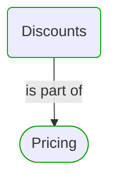
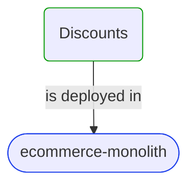


# [*Domain module*] Discounts

This view contains details information about Discounts domain module, including:
- other related modules
- related processes
- related building blocks
- related deployable units
- engaged people: actors, development teams, business stakeholders  

---

## Domain Perspective

### Related modules

### Related processes

### Direct building blocks

```mermaid
  flowchart TB
    0(Discounts)
    class 0 DomainPerspective
    1([ClientLevelDiscounts])
    class 1 DomainPerspective
    0-->|contains|1
    2([Discount])
    class 2 DomainPerspective
    0-->|contains|2
    3([Discount])
    class 3 DomainPerspective
    0-->|contains|3
    4([DiscountsRepository])
    class 4 DomainPerspective
    0-->|contains|4
    5([DiscountsSqlRepository])
    class 5 DomainPerspective
    0-->|contains|5
    6([PercentageDiscount])
    class 6 DomainPerspective
    0-->|contains|6
    7([PercentageDiscount])
    class 7 DomainPerspective
    0-->|contains|7
    8([ProductDiscount])
    class 8 DomainPerspective
    0-->|contains|8
    9([ProductLevelDiscounts])
    class 9 DomainPerspective
    0-->|contains|9
    10([ValueDiscount])
    class 10 DomainPerspective
    0-->|contains|10
    11([ValueDiscount])
    class 11 DomainPerspective
    0-->|contains|11
    classDef DomainPerspective stroke:#009900
    classDef TechnologyPerspective stroke:#1F41EB
    classDef PeoplePerspective stroke:#FFF014
```

## Technology Perspective

### Related deployable units

## People Perspective

### Engaged people

## Next steps

### Zoom-out

- [Business processes](../../../../Business_Processes.md)

### Change perspective

- [[*Deployable unit*] ecommerce-monolith](../../../../DeployableUnits/ecommerce-monolith.md)
- [[*Domain building block*] ClientLevelDiscounts](../../../../BuildingBlocks/Sales/Pricing/Discounts/ClientLevelDiscounts.md)
- [[*Domain building block*] ProductDiscount](../../../../BuildingBlocks/Sales/Pricing/Discounts/ProductDiscount.md)
- [[*Domain building block*] Discount](../../../../BuildingBlocks/Sales/Pricing/Discounts/Discount.md)
- [[*Domain building block*] Discount](../../../../BuildingBlocks/Sales/Pricing/Discounts/Discount.md)
- [[*Domain building block*] DiscountsRepository](../../../../BuildingBlocks/Sales/Pricing/Discounts/DiscountsRepository.md)
- [[*Domain building block*] DiscountsSqlRepository](../../../../BuildingBlocks/Sales/Pricing/Discounts/DiscountsSqlRepository.md)
- [[*Domain building block*] ValueDiscount](../../../../BuildingBlocks/Sales/Pricing/Discounts/ValueDiscount.md)
- [[*Domain building block*] ValueDiscount](../../../../BuildingBlocks/Sales/Pricing/Discounts/ValueDiscount.md)
- [[*Domain building block*] ProductLevelDiscounts](../../../../BuildingBlocks/Sales/Pricing/Discounts/ProductLevelDiscounts.md)
- [[*Domain building block*] PercentageDiscount](../../../../BuildingBlocks/Sales/Pricing/Discounts/PercentageDiscount.md)
- [[*Domain building block*] PercentageDiscount](../../../../BuildingBlocks/Sales/Pricing/Discounts/PercentageDiscount.md)

---

[P3 Model](https://github.com/P3-model/P3-model) documentation generated from source code using [.net tooling](https://github.com/P3-model/P3-model-dotnet)