# Discounts

This view contains details information about Discounts domain module, including:
- other related modules
- related processes
- related building blocks
- related deployable units
- engaged people: actors, development teams, business stakeholders  

---

## Domain Perspective

### Related modules

### Related processes

### Direct building blocks

```mermaid
  flowchart TB
    0(Discounts)
    class 0 DomainPerspective
    1([Client Level Discounts])
    class 1 DomainPerspective
    0-->|contains|1
    2([Discount])
    class 2 DomainPerspective
    0-->|contains|2
    3([Discount])
    class 3 DomainPerspective
    0-->|contains|3
    4([Discounts Repository])
    class 4 DomainPerspective
    0-->|contains|4
    5([Discounts Sql Repository])
    class 5 DomainPerspective
    0-->|contains|5
    6([Percentage Discount])
    class 6 DomainPerspective
    0-->|contains|6
    7([Percentage Discount])
    class 7 DomainPerspective
    0-->|contains|7
    8([Product Discount])
    class 8 DomainPerspective
    0-->|contains|8
    9([Product Level Discounts])
    class 9 DomainPerspective
    0-->|contains|9
    10([Value Discount])
    class 10 DomainPerspective
    0-->|contains|10
    11([Value Discount])
    class 11 DomainPerspective
    0-->|contains|11
    classDef DomainPerspective stroke:#009900
    classDef TechnologyPerspective stroke:#1F41EB
    classDef PeoplePerspective stroke:#FFF014
```

## Technology Perspective

### Related deployable units

## People Perspective

### Engaged people

## Next steps

### Zoom-in

#### Domain perspective

##### Ddd domain services

[Client Level Discounts](Client Level Discounts.md)  
[Discount](Discount.md)  
[Percentage Discount](Percentage Discount.md)  
[Product Level Discounts](Product Level Discounts.md)  
[Value Discount](Value Discount.md)  

##### Ddd repositories

[Discounts Repository](Discounts Repository.md)  
[Discounts Sql Repository](Discounts Sql Repository.md)  

##### Ddd value objects

[Discount](Discount.md)  
[Percentage Discount](Percentage Discount.md)  
[Product Discount](Product Discount.md)  
[Value Discount](Value Discount.md)  

#### Technology perspective

##### Deployable units

[ecommerce-monolith](../../../../DeployableUnits/ecommerce-monolith.md)  

#### People perspective

##### Business organizational units

[Sales department](../../../../BusinessOrganizationalUnits/Sales department.md)  

##### Development teams

[Core team](../../../../Teams/Core team.md)  

### Zoom-out

#### Domain perspective

##### Domain modules

[Pricing](../Pricing.md)  

---

[P3 Model](https://github.com/P3-model/P3-model) documentation generated from source code using [.net tooling](https://github.com/P3-model/P3-model-dotnet)