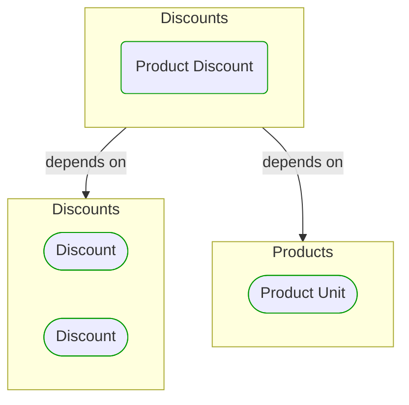


# Product Discount

This view contains details information about Product Discount building block, including:
- dependencies
- modules
- related processes  

---

## Domain Perspective

### Dependencies

### Related process steps

Product Discount is not used directly in any process step.  

## Next steps

### Zoom-in

#### Domain perspective

##### Ddd domain services

[Discount](Discount.md)  

##### Ddd value objects

[Discount](Discount.md)  
[Product Unit](../../Products/Product Unit.md)  

### Zoom-out

#### Domain perspective

##### Domain modules

[Discounts](Discounts.md)  

---

[P3 Model](https://github.com/P3-model/P3-model) documentation generated from source code using [.net tooling](https://github.com/P3-model/P3-model-dotnet)