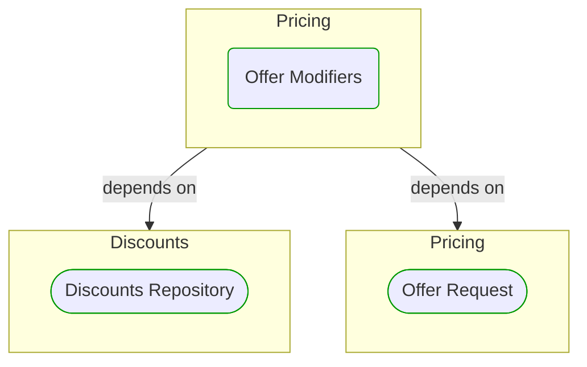


# Offer Modifiers

This view contains details information about Offer Modifiers building block, including:
- dependencies
- modules
- related processes  

---

## Domain Perspective

### Dependencies

### Related process steps

Offer Modifiers is not used directly in any process step.  

## Next steps

### Zoom-in

#### Domain perspective

##### Ddd repositories

[Discounts Repository](Discounts/Discounts Repository.md)  

##### Ddd value objects

[Offer Request](Offer Request.md)  

### Zoom-out

#### Domain perspective

##### Domain modules

[Pricing](Pricing.md)  

---

[P3 Model](https://github.com/P3-model/P3-model) documentation generated from source code using [.net tooling](https://github.com/P3-model/P3-model-dotnet)