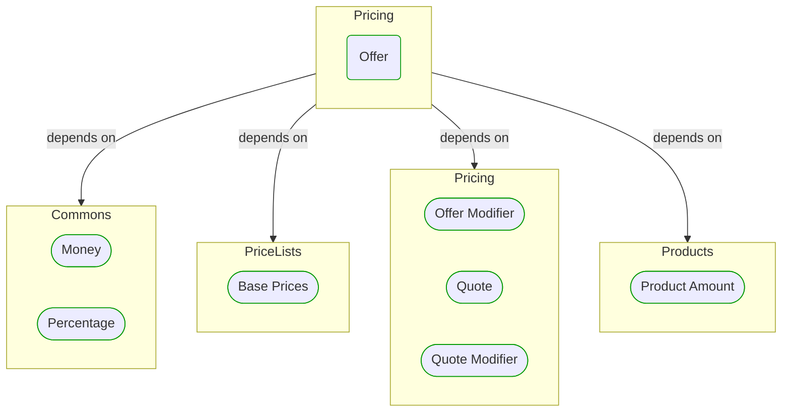
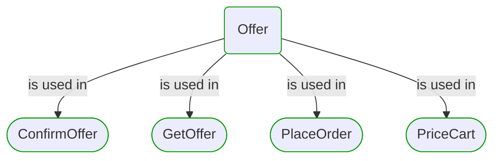


# Offer

This view contains details information about Offer building block, including:
- dependencies
- modules
- related processes  

---

## Domain Perspective

### Dependencies

### Related process steps

## Next steps

### Zoom-in

#### Domain perspective

##### Ddd domain services

[Offer Modifier](Offer Modifier.md)  
[Quote Modifier](Quote Modifier.md)  

##### Ddd value objects

[Base Prices](PriceLists/Base Prices.md)  
[Money](../Commons/Money.md)  
[Percentage](../Commons/Percentage.md)  
[Product Amount](../Products/Product Amount.md)  
[Quote](Quote.md)  

### Zoom-out

#### Domain perspective

##### Domain modules

[Pricing](Pricing.md)  

---

[P3 Model](https://github.com/P3-model/P3-model) documentation generated from source code using [.net tooling](https://github.com/P3-model/P3-model-dotnet)