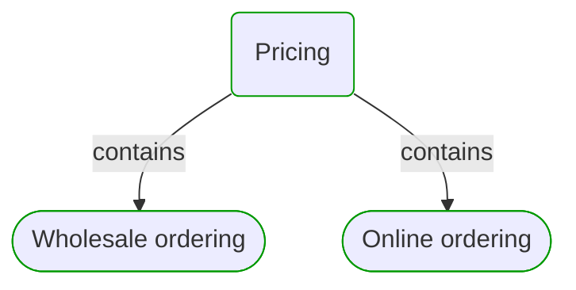

# [*Domain module*] Pricing

This view contains details information about Pricing domain module, including:
- other related modules
- related processes
- related building blocks
- related deployable units
- engaged people: actors, development teams, business stakeholders  

---

## Domain Perspective

### Related modules

### Related processes

### Direct building blocks

## Technology Perspective

### Related deployable units

## People Perspective

### Engaged people

## Next steps

### Zoom-out

- [Business processes](../../../Business_Processes.md)

### Change perspective

- [[*Deployable unit*] ecommerce-monolith](../../../DeployableUnits/ecommerce-monolith.md)
- [[*Domain building block*] CalculatePrices](../../../BuildingBlocks/Sales/Pricing/CalculatePrices.md)
- [[*Domain building block*] OfferModifier2](../../../BuildingBlocks/Sales/Pricing/OfferModifier2.md)
- [[*Domain building block*] OfferModifiers](../../../BuildingBlocks/Sales/Pricing/OfferModifiers.md)
- [[*Domain building block*] QuoteModifier](../../../BuildingBlocks/Sales/Pricing/QuoteModifier.md)
- [[*Domain building block*] PriceListSqlRepository](../../../BuildingBlocks/Sales/Pricing/PriceListSqlRepository.md)
- [[*Domain building block*] Quote](../../../BuildingBlocks/Sales/Pricing/Quote.md)
- [[*Domain building block*] OfferModifier](../../../BuildingBlocks/Sales/Pricing/OfferModifier.md)
- [[*Domain building block*] PriceModifier](../../../BuildingBlocks/Sales/Pricing/PriceModifier.md)
- [[*Domain building block*] Offer](../../../BuildingBlocks/Sales/Pricing/Offer.md)
- [[*Domain building block*] OfferRequest](../../../BuildingBlocks/Sales/Pricing/OfferRequest.md)
- [[*Domain building block*] IndividualSalesConditions](../../../BuildingBlocks/Sales/Pricing/IndividualSalesConditions.md)
- [[*Business process*] Wholesale ordering](../../../Processes/Sale/Wholesale ordering/Wholesale ordering.md)
- [[*Business process*] Online ordering](../../../Processes/Sale/Online ordering/Online ordering.md)

---

[P3 Model](https://github.com/P3-model/P3-model) documentation generated from source code using [.net tooling](https://github.com/P3-model/P3-model-dotnet)