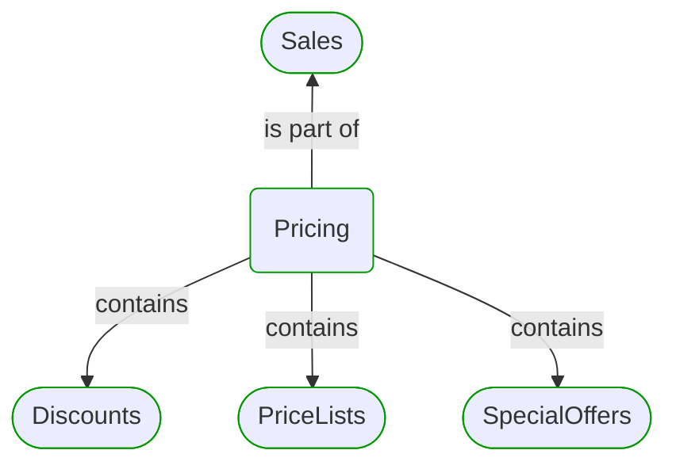

# Pricing

This view contains details information about Pricing domain module, including:
- other related modules
- related processes
- related building blocks
- related deployable units
- engaged people: actors, development teams, business stakeholders  

---

## Domain Perspective

### Related modules

### Related processes

### Direct building blocks

## Technology Perspective

### Related deployable units

## People Perspective

### Engaged people

## Next steps

### Zoom-in

#### Domain perspective

##### Ddd domain services

[Calculate Prices](Calculate Prices.md)  
[Individual Sales Conditions](Individual Sales Conditions.md)  
[Offer Modifier](Offer Modifier.md)  
[Offer Modifier 2](Offer Modifier 2.md)  
[Price Modifier](Price Modifier.md)  
[Quote Modifier](Quote Modifier.md)  

##### Ddd factories

[Offer Modifiers](Offer Modifiers.md)  

##### Ddd repositories

[Price List Sql Repository](Price List Sql Repository.md)  

##### Ddd value objects

[Offer](Offer.md)  
[Offer Request](Offer Request.md)  
[Quote](Quote.md)  

##### Domain modules

[Discounts](Discounts/Discounts.md)  
[PriceLists](PriceLists/PriceLists.md)  
[SpecialOffers](SpecialOffers/SpecialOffers.md)  

##### Processes

[Online ordering](../../../Processes/Sale/Online ordering/Online ordering.md)  
[Wholesale ordering](../../../Processes/Sale/Wholesale ordering/Wholesale ordering.md)  

#### Technology perspective

##### Deployable units

[ecommerce-monolith](../../../DeployableUnits/ecommerce-monolith.md)  

#### People perspective

##### Business organizational units

[Sales department](../../../BusinessOrganizationalUnits/Sales department.md)  

##### Development teams

[Core team](../../../Teams/Core team.md)  

### Zoom-out

#### Domain perspective

##### Domain modules

[Sales](../Sales.md)  

---

[P3 Model](https://github.com/P3-model/P3-model) documentation generated from source code using [.net tooling](https://github.com/P3-model/P3-model-dotnet)