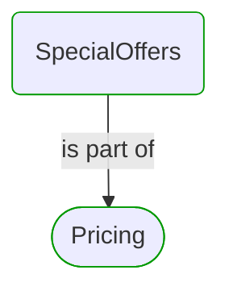
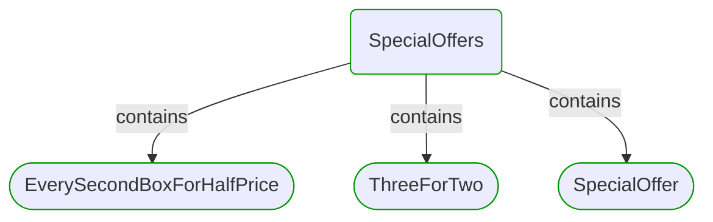
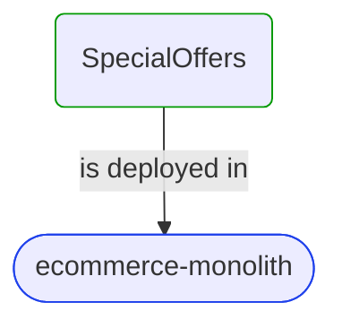

# [*Domain module*] SpecialOffers

This view contains details information about SpecialOffers domain module, including:
- other related modules
- related processes
- related building blocks
- related deployable units
- engaged people: actors, development teams, business stakeholders  

---

## Domain Perspective

### Related modules

### Related processes

### Direct building blocks

## Technology Perspective

### Related deployable units

## People Perspective

### Engaged people

## Next steps

### Zoom-out

- [Business processes](../../../../Business_Processes.md)

### Change perspective

- [[*Deployable unit*] ecommerce-monolith](../../../../DeployableUnits/ecommerce-monolith.md)
- [[*Domain building block*] ThreeForTwo](../../../../BuildingBlocks/Sales/Pricing/SpecialOffers/ThreeForTwo.md)
- [[*Domain building block*] EverySecondBoxForHalfPrice](../../../../BuildingBlocks/Sales/Pricing/SpecialOffers/EverySecondBoxForHalfPrice.md)
- [[*Domain building block*] SpecialOffer](../../../../BuildingBlocks/Sales/Pricing/SpecialOffers/SpecialOffer.md)

---

[P3 Model](https://github.com/P3-model/P3-model) documentation generated from source code using [.net tooling](https://github.com/P3-model/P3-model-dotnet)