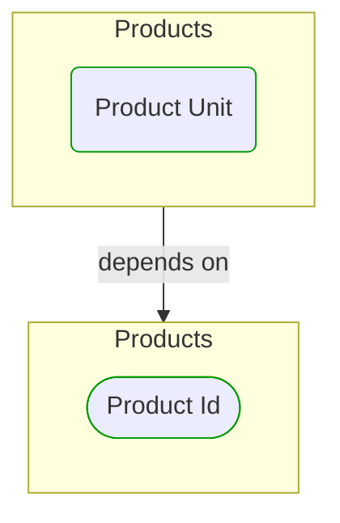


# Product Unit

This view contains details information about Product Unit building block, including:
- dependencies
- modules
- related processes  

---

## Domain Perspective

### Dependencies

### Related process steps

Product Unit is not used directly in any process step.  

## Next steps

### Zoom-in

#### Domain perspective

##### Ddd value objects

[Product Id](Product Id.md)  

### Zoom-out

#### Domain perspective

##### Domain modules

[Products](Products.md)  

---

[P3 Model](https://github.com/P3-model/P3-model) documentation generated from source code using [.net tooling](https://github.com/P3-model/P3-model-dotnet)