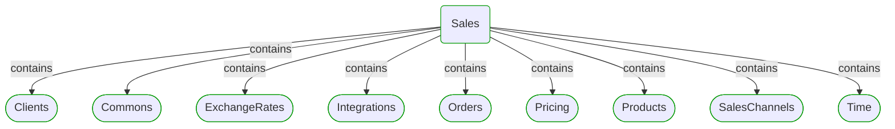
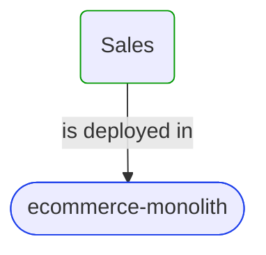


# Sales

This view contains details information about Sales domain module, including:
- other related modules
- related processes
- related building blocks
- related deployable units
- engaged people: actors, development teams, business stakeholders  

---

## Domain Perspective

### Related modules

### Related processes

### Direct building blocks

Module doesn't contain direct building blocks.  

## Technology Perspective

### Related deployable units

## People Perspective

### Engaged people

## Next steps

### Zoom-in

#### Domain perspective

##### Domain modules

[Clients](Clients/Clients.md)  
[Commons](Commons/Commons.md)  
[ExchangeRates](ExchangeRates/ExchangeRates.md)  
[Integrations](Integrations/Integrations.md)  
[Orders](Orders/Orders.md)  
[Pricing](Pricing/Pricing.md)  
[Products](Products/Products.md)  
[SalesChannels](SalesChannels/SalesChannels.md)  
[Time](Time/Time.md)  

##### Processes

[Online ordering](../../Processes/Sale/Online ordering/Online ordering.md)  
[Wholesale ordering](../../Processes/Sale/Wholesale ordering/Wholesale ordering.md)  

#### Technology perspective

##### Deployable units

[ecommerce-monolith](../../DeployableUnits/ecommerce-monolith.md)  

#### People perspective

##### Business organizational units

[Sales department](../../BusinessOrganizationalUnits/Sales department.md)  

##### Development teams

[Core team](../../Teams/Core team.md)  

### Zoom-out

#### Domain perspective

##### Cross elements

[Domain Modules](../../Modules.md)  

---

[P3 Model](https://github.com/P3-model/P3-model) documentation generated from source code using [.net tooling](https://github.com/P3-model/P3-model-dotnet)