# [*Domain module*] Sales

This view contains details information about Sales domain module, including:
- other related modules
- related processes
- related building blocks
- related deployable units
- engaged people: actors, development teams, business stakeholders  

---

## Domain Perspective

### Related modules

```mermaid
  flowchart TB
    0(Sales)
    class 0 DomainPerspective
    1([Clients])
    class 1 DomainPerspective
    0-->|contains|1
    2([Commons])
    class 2 DomainPerspective
    0-->|contains|2
    3([ExchangeRates])
    class 3 DomainPerspective
    0-->|contains|3
    4([Fulfillment])
    class 4 DomainPerspective
    0-->|contains|4
    5([Integrations])
    class 5 DomainPerspective
    0-->|contains|5
    6([OnlineOrdering])
    class 6 DomainPerspective
    0-->|contains|6
    7([Orders])
    class 7 DomainPerspective
    0-->|contains|7
    8([Pricing])
    class 8 DomainPerspective
    0-->|contains|8
    9([Products])
    class 9 DomainPerspective
    0-->|contains|9
    10([SalesChannels])
    class 10 DomainPerspective
    0-->|contains|10
    11([Time])
    class 11 DomainPerspective
    0-->|contains|11
    12([WholesaleOrdering])
    class 12 DomainPerspective
    0-->|contains|12
    classDef DomainPerspective stroke:#009900
    classDef TechnologyPerspective stroke:#1F41EB
    classDef PeoplePerspective stroke:#FFF014
```

### Related processes

### Direct building blocks

Module doesn't contain direct building blocks.  

## Technology Perspective

### Related deployable units

## People Perspective

### Engaged people

## Next steps

### Zoom-out

- [Business processes](../../Business_Processes.md)

### Change perspective

- [[*Business organizational unit*] Sales department](../../BusinessOrganizationalUnits/Sales department.md)
- [[*Deployable unit*] ecommerce-monolith](../../DeployableUnits/ecommerce-monolith.md)
- [[*Development team*] Core team](../../Teams/Core team.md)
- [[*Business process*] Online ordering](../../Processes/Sale/Online ordering/Online ordering.md)
- [[*Business process*] Wholesale ordering](../../Processes/Sale/Wholesale ordering/Wholesale ordering.md)

---

[P3 Model](https://github.com/P3-model/P3-model) documentation generated from source code using [.net tooling](https://github.com/P3-model/P3-model-dotnet)