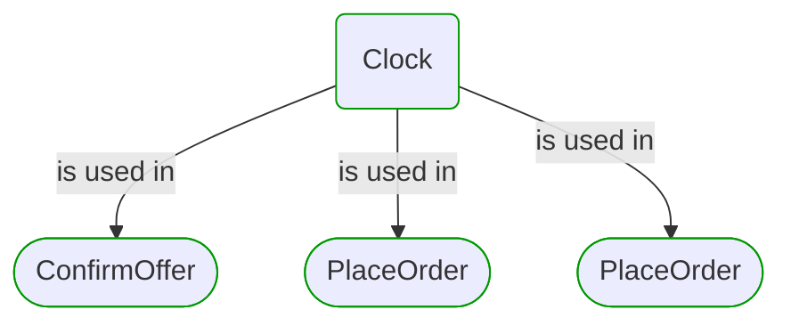


# Clock

This view contains details information about Clock building block, including:
- dependencies
- modules
- related processes  

---

## Domain Perspective

### Dependencies

Clock has no dependencies.  

### Related process steps

## Next steps

### Zoom-out

#### Domain perspective

##### Domain modules

[Time](Time.md)  

---

[P3 Model](https://github.com/P3-model/P3-model) documentation generated from source code using [.net tooling](https://github.com/P3-model/P3-model-dotnet)