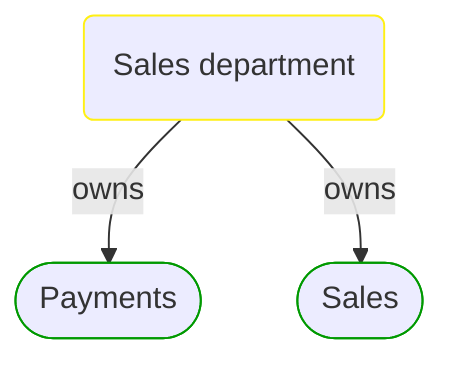

# Sales department

***Business Organizational Unit***  

This view contains details information about Sales department, including:
- related domain modules  

---

## Domain Perspective

### Related domain modules

## Next steps

### Zoom-in

#### Domain perspective

##### Domain Modules

[Payments](../../Domain/Concepts/Payments/Payments.md)  
[Sales](../../Domain/Concepts/Sales/Sales.md)  

### Zoom-out

#### Domain perspective

[Domain Module Owners](../../Domain/Concepts/DomainModuleOwners.md)  

#### People perspective

[Business Organizational Units](BusinessOrganizationalUnits.md)  

---

[P3 Model](https://github.com/P3-model/P3-model) documentation generated from source code using [.net tooling](https://github.com/P3-model/P3-model-dotnet)