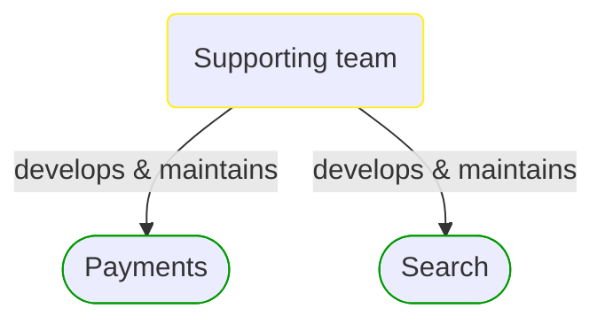
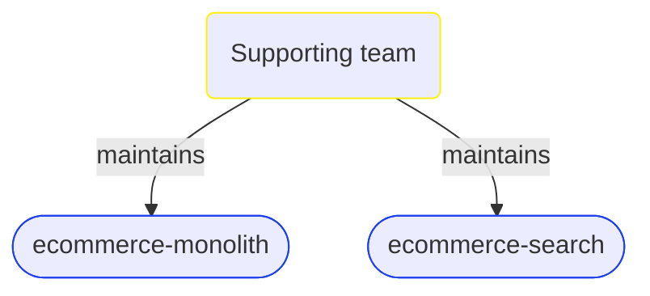


# Supporting team

***Development Team***  

This view contains details information about Supporting team team, including:
- related domain modules
- related deployable units  

---

## Domain Perspective

### Related domain modules

## Technology Perspective

### Related deployable units

## Next use cases

### Zoom-in

#### Domain perspective

##### Domain Modules

[Payments](../../Domain/Modules/Payments/Payments-module.md)  
[Search](../../Domain/Modules/Search/Search-module.md)  

#### Technology perspective

##### Deployable Units

[ecommerce-monolith](../../Technology/DeployableUnits/EcommerceMonolith.md)  
[ecommerce-search](../../Technology/DeployableUnits/EcommerceSearch.md)  

### Zoom-out

#### Domain perspective

[Domain Module Owners](../../Domain/Modules/ModuleOwners.md)  

#### People perspective

[Development Teams](DevelopmentTeams.md)  

---

[P3 Model](https://github.com/P3-model/P3-model) documentation generated from source code using [.net tooling](https://github.com/P3-model/P3-model-dotnet)