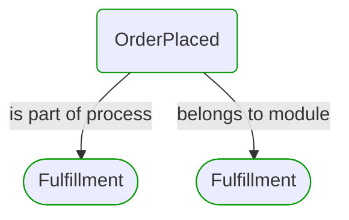
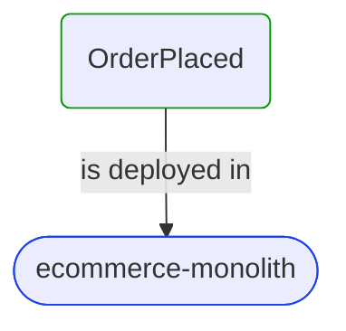
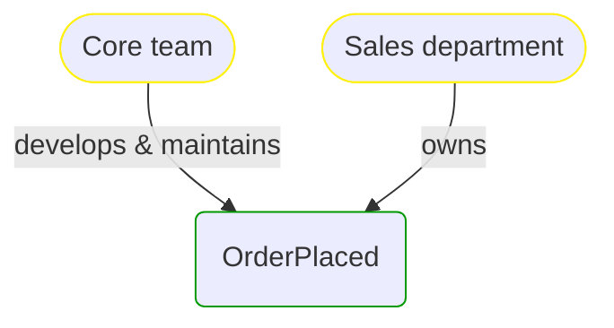


# [*Process Step*] OrderPlaced

This view contains details information about OrderPlaced business processes step, including:
- related process
- next process steps
- related domain module
- related deployable unit
- engaged people: actors, development teams, business stakeholders  

---

## Domain Perspective

### Module & Process

### Used Building Blocks

No building blocks are used. Maybe this process step is not implemented yet?  

## Technology Perspective

## People Perspective

## Next steps

### Zoom-out

- [[*Business process*] Fulfillment](../../../Processes/Sale/Fulfillment/Fulfillment.md)

### Change perspective

- [[*Deployable unit*] ecommerce-monolith](../../../DeployableUnits/ecommerce-monolith.md)
- [[*Business organizational unit*] Sales department](../../../BusinessOrganizationalUnits/Sales department.md)
- [[*Development team*] Core team](../../../Teams/Core team.md)
- [[*Domain module*] Fulfillment](../../../Modules/Sales/Fulfillment/Fulfillment.md)
- [[*Business process*] Fulfillment](../../../Processes/Sale/Fulfillment/Fulfillment.md)

---

[P3 Model](https://github.com/P3-model/P3-model) documentation generated from source code using [.net tooling](https://github.com/P3-model/P3-model-dotnet)