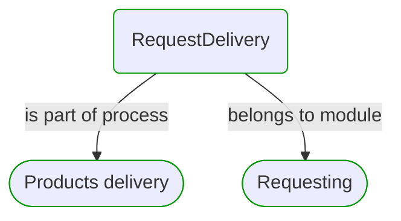
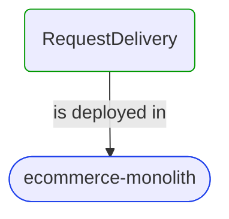
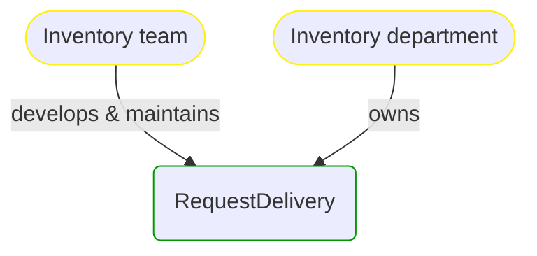

# [*Process Step*] RequestDelivery

This view contains details information about RequestDelivery business processes step, including:
- related process
- next process steps
- related domain module
- related deployable unit
- engaged people: actors, development teams, business stakeholders  

---

## Domain Perspective

### Module & Process

### Used Building Blocks

No building blocks are used. Maybe this process step is not implemented yet?  

## Technology Perspective

## People Perspective

## Next steps

### Zoom-out

- [[*Business process*] Products delivery](../../../Processes/Sale/Products delivery/Products delivery.md)

### Change perspective

- [[*Deployable unit*] ecommerce-monolith](../../../DeployableUnits/ecommerce-monolith.md)
- [[*Business organizational unit*] Inventory department](../../../BusinessOrganizationalUnits/Inventory department.md)
- [[*Development team*] Inventory team](../../../Teams/Inventory team.md)
- [[*Domain module*] Requesting](../../../Modules/ProductsDelivery/Requesting/Requesting.md)
- [[*Business process*] Products delivery](../../../Processes/Sale/Products delivery/Products delivery.md)

---

[P3 Model](https://github.com/P3-model/P3-model) documentation generated from source code using [.net tooling](https://github.com/P3-model/P3-model-dotnet)