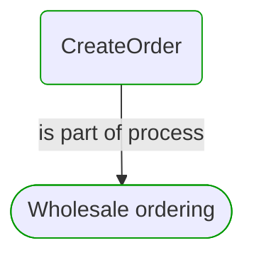
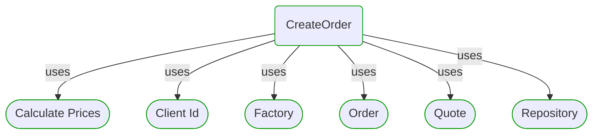
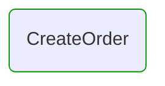
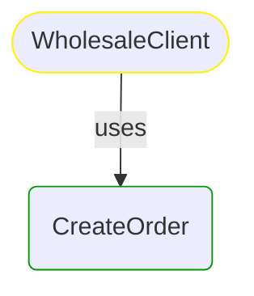

# CreateOrder

This view contains details information about CreateOrder business processes step, including:
- related process
- next process steps
- related domain module
- related deployable unit
- engaged people: actors, development teams, business stakeholders  

---

## Domain Perspective

### Module & Process

### Used Building Blocks

## Technology Perspective

## People Perspective

## Next steps

### Zoom-in

#### Domain perspective

##### Processes

[Wholesale ordering](../../../Processes/Sale/Wholesale ordering/Wholesale ordering.md)  

### Zoom-out

#### Domain perspective

##### Processes

[Wholesale ordering](../../../Processes/Sale/Wholesale ordering/Wholesale ordering.md)  

---

[P3 Model](https://github.com/P3-model/P3-model) documentation generated from source code using [.net tooling](https://github.com/P3-model/P3-model-dotnet)