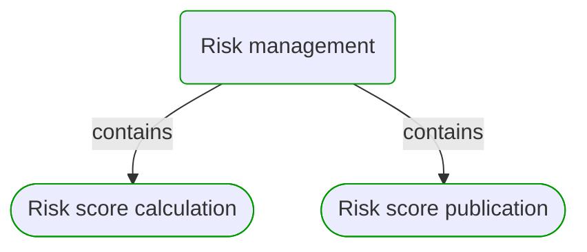
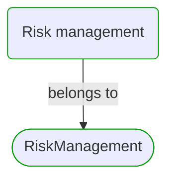
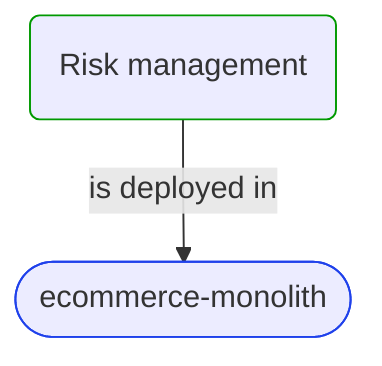
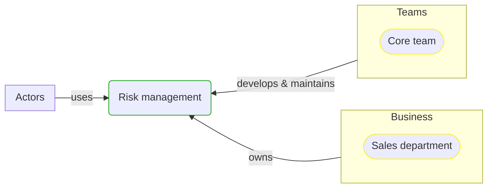


# [*Business process*] Risk management

This view contains details information about Risk management business process, including:
- other related processes
- process steps
- related domain modules
- related deployable units
- engaged people: actors, development teams, business stakeholders  

---

## Domain Perspective

### Related processes and steps

### Related modules

## Technology Perspective

### Related deployable units

## People Perspective

### Engaged people

## Next steps

### Zoom-in

  - [[*Business process*] Risk score calculation](Risk score calculation/Risk score calculation.md)
  - [[*Business process*] Risk score publication](Risk score publication/Risk score publication.md)

### Zoom-out

- [Business processes](../../Business_Processes.md)

### Change perspective

- [[*Business organizational unit*] Sales department](../../BusinessOrganizationalUnits/Sales department.md)
- [[*Deployable unit*] ecommerce-monolith](../../DeployableUnits/ecommerce-monolith.md)
- [[*Development team*] Core team](../../Teams/Core team.md)
- [[*Business process*] Risk score publication](Risk score publication/Risk score publication.md)
- [[*Business process*] Risk score calculation](Risk score calculation/Risk score calculation.md)

---

[P3 Model](https://github.com/P3-model/P3-model) documentation generated from source code using [.net tooling](https://github.com/P3-model/P3-model-dotnet)