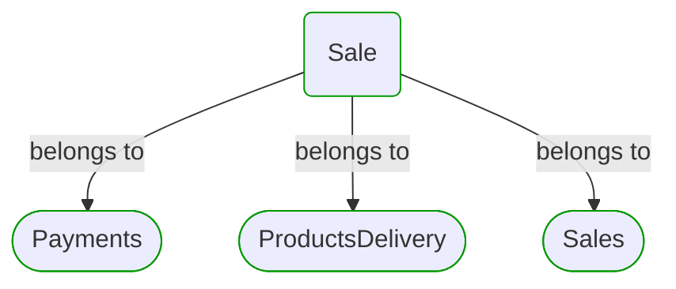
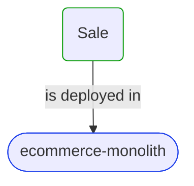
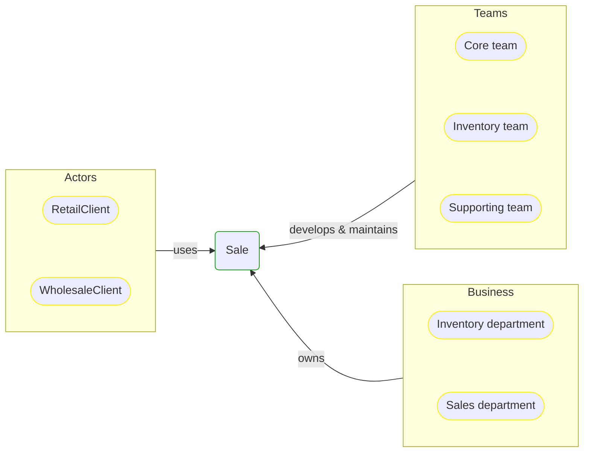


# [*Business process*] Sale

This view contains details information about Sale business process, including:
- other related processes
- process steps
- related domain modules
- related deployable units
- engaged people: actors, development teams, business stakeholders  

---

## Domain Perspective

### Related processes and steps

### Related modules

## Technology Perspective

### Related deployable units

## People Perspective

### Engaged people

## Next steps

### Zoom-in

  - [[*Business process*] Fulfillment](Fulfillment/Fulfillment.md)
  - [[*Business process*] Online ordering](Online ordering/Online ordering.md)
  - [[*Business process*] Payment](Payment/Payment.md)
  - [[*Business process*] Products delivery](Products delivery/Products delivery.md)
  - [[*Business process*] Wholesale ordering](Wholesale ordering/Wholesale ordering.md)

### Zoom-out

- [Business processes](../../Business_Processes.md)

### Change perspective

- [[*Business organizational unit*] Inventory department](../../BusinessOrganizationalUnits/Inventory department.md)
- [[*Business organizational unit*] Sales department](../../BusinessOrganizationalUnits/Sales department.md)
- [[*Deployable unit*] ecommerce-monolith](../../DeployableUnits/ecommerce-monolith.md)
- [[*Development team*] Core team](../../Teams/Core team.md)
- [[*Development team*] Supporting team](../../Teams/Supporting team.md)
- [[*Development team*] Inventory team](../../Teams/Inventory team.md)
- [[*Business process*] Products delivery](Products delivery/Products delivery.md)
- [[*Business process*] Payment](Payment/Payment.md)
- [[*Business process*] Online ordering](Online ordering/Online ordering.md)
- [[*Business process*] Fulfillment](Fulfillment/Fulfillment.md)
- [[*Business process*] Wholesale ordering](Wholesale ordering/Wholesale ordering.md)

---

[P3 Model](https://github.com/P3-model/P3-model) documentation generated from source code using [.net tooling](https://github.com/P3-model/P3-model-dotnet)