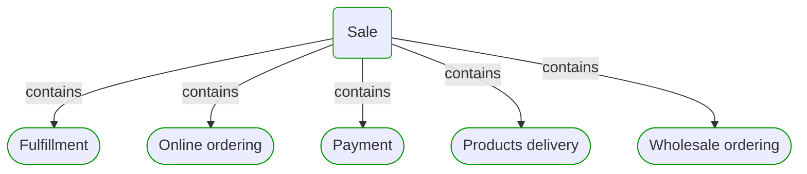
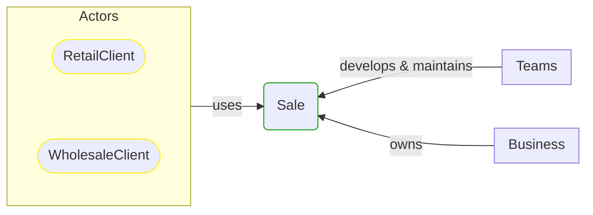


# Sale

This view contains details information about Sale business process, including:
- other related processes
- process steps
- related domain modules
- related deployable units
- engaged people: actors, development teams, business stakeholders  

---

## Domain Perspective

### Related processes and steps

### Related modules

## Technology Perspective

### Related deployable units

## People Perspective

### Engaged people

## Next steps

### Zoom-in

#### Domain perspective

##### Processes

[Fulfillment](Fulfillment/Fulfillment.md)  
[Online ordering](Online ordering/Online ordering.md)  
[Payment](Payment/Payment.md)  
[Products delivery](Products delivery/Products delivery.md)  
[Wholesale ordering](Wholesale ordering/Wholesale ordering.md)  

### Zoom-out

#### Domain perspective

##### Cross elements

[Business processes](../../Business_Processes.md)  

---

[P3 Model](https://github.com/P3-model/P3-model) documentation generated from source code using [.net tooling](https://github.com/P3-model/P3-model-dotnet)