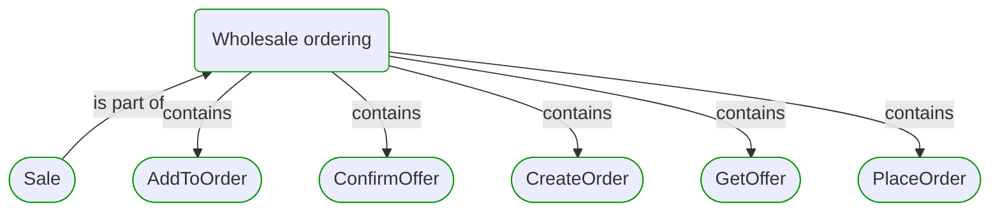
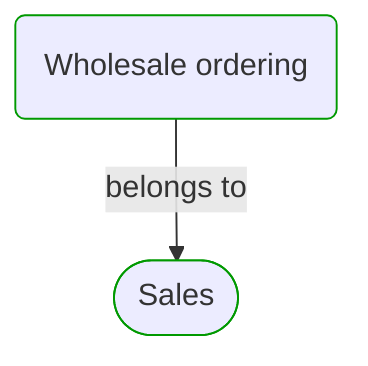
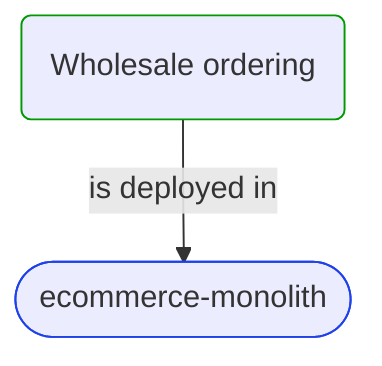
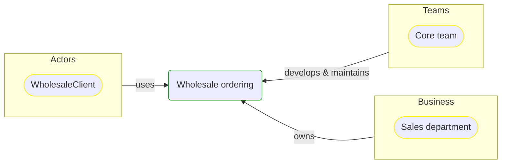


# [*Business process*] Wholesale ordering

This view contains details information about Wholesale ordering business process, including:
- other related processes
- process steps
- related domain modules
- related deployable units
- engaged people: actors, development teams, business stakeholders  

---

## Domain Perspective

### Related processes and steps

### Related modules

## Technology Perspective

### Related deployable units

## People Perspective

### Engaged people

## Next steps

### Zoom-in

- [[*Process Step*] AddToOrder](../../../ProcessSteps/Sale/Wholesale ordering/AddToOrder.md)
- [[*Process Step*] ConfirmOffer](../../../ProcessSteps/Sale/Wholesale ordering/ConfirmOffer.md)
- [[*Process Step*] PlaceOrder](../../../ProcessSteps/Sale/Wholesale ordering/PlaceOrder.md)
- [[*Process Step*] GetOffer](../../../ProcessSteps/Sale/Wholesale ordering/GetOffer.md)
- [[*Process Step*] CreateOrder](../../../ProcessSteps/Sale/Wholesale ordering/CreateOrder.md)

### Zoom-out

- [Business processes](../../../Business_Processes.md)

### Change perspective

- [[*Business organizational unit*] Sales department](../../../BusinessOrganizationalUnits/Sales department.md)
- [[*Deployable unit*] ecommerce-monolith](../../../DeployableUnits/ecommerce-monolith.md)
- [[*Development team*] Core team](../../../Teams/Core team.md)
- [[*Process Step*] AddToOrder](../../../ProcessSteps/Sale/Wholesale ordering/AddToOrder.md)
- [[*Process Step*] ConfirmOffer](../../../ProcessSteps/Sale/Wholesale ordering/ConfirmOffer.md)
- [[*Process Step*] PlaceOrder](../../../ProcessSteps/Sale/Wholesale ordering/PlaceOrder.md)
- [[*Process Step*] GetOffer](../../../ProcessSteps/Sale/Wholesale ordering/GetOffer.md)
- [[*Process Step*] CreateOrder](../../../ProcessSteps/Sale/Wholesale ordering/CreateOrder.md)

---

[P3 Model](https://github.com/P3-model/P3-model) documentation generated from source code using [.net tooling](https://github.com/P3-model/P3-model-dotnet)