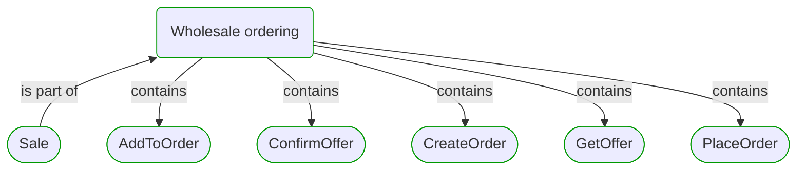
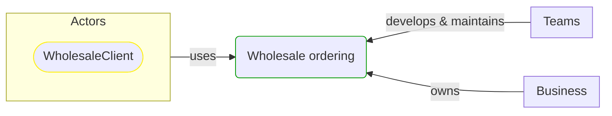

# Wholesale ordering

This view contains details information about Wholesale ordering business process, including:
- other related processes
- process steps
- related domain modules
- related deployable units
- engaged people: actors, development teams, business stakeholders  

---

## Domain Perspective

### Related processes and steps

### Related modules

## Technology Perspective

### Related deployable units

## People Perspective

### Engaged people

## Next steps

### Zoom-in

#### Domain perspective

##### Process steps

[AddToOrder](../../../ProcessSteps/Sale/Wholesale ordering/AddToOrder.md)  
[ConfirmOffer](../../../ProcessSteps/Sale/Wholesale ordering/ConfirmOffer.md)  
[CreateOrder](../../../ProcessSteps/Sale/Wholesale ordering/CreateOrder.md)  
[GetOffer](../../../ProcessSteps/Sale/Wholesale ordering/GetOffer.md)  
[PlaceOrder](../../../ProcessSteps/Sale/Wholesale ordering/PlaceOrder.md)  

### Zoom-out

#### Domain perspective

##### Cross elements

[Business processes](../../../Business_Processes.md)  

---

[P3 Model](https://github.com/P3-model/P3-model) documentation generated from source code using [.net tooling](https://github.com/P3-model/P3-model-dotnet)