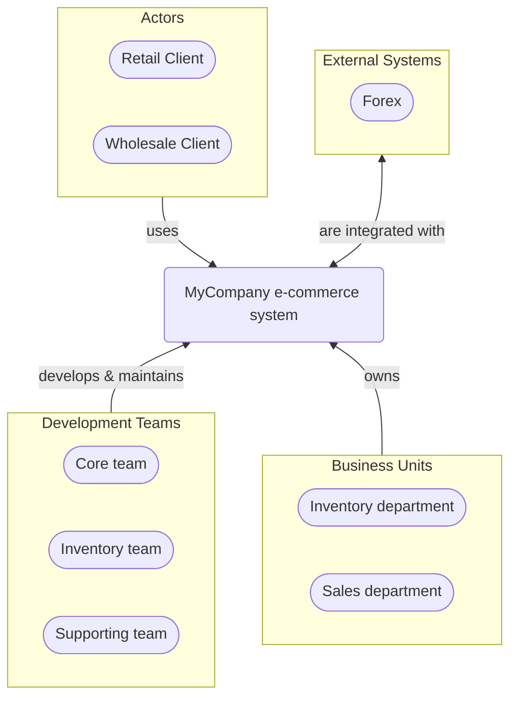


# P3 Model documentation for MyCompany e-commerce

---

## System Landscape

## Next steps

### Zoom-in

#### Domain perspective

[Business Processes](Domain/Processes/BusinessProcesses.md)  
[Domain Glossary](Domain/Glossary/Domain_Glossary.md)  
[Domain Modules](Domain/Concepts/DomainModules.md)  

#### Technology perspective

[Deployable Units](Technology/DeployableUnits/DeployableUnits.md)  

#### People perspective

[Business Organizational Units](People/BusinessOrganizationalUnits/BusinessOrganizationalUnits.md)  
[Development Teams](People/DevelopmentTeams/DevelopmentTeams.md)  

---

[P3 Model](https://github.com/P3-model/P3-model) documentation generated from source code using [.net tooling](https://github.com/P3-model/P3-model-dotnet)