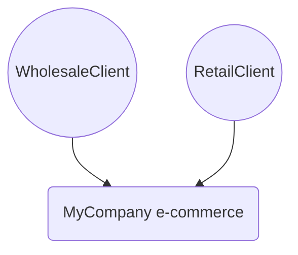


# P3 Model documentation for MyCompany e-commerce

## Product Landscape

## Domain Vision Statement

[Link](DomainVisionStatement.md)
## Next steps

### Zoom-in

- [Business organizational units](Business_Organizational_Units.md)
- [Deployable units](Deployable_Units.md)
- [Development teams](Development_Teams.md)
- [Domain Glossary](Glossary/Domain_Glossary.md)
- [Domain Modules](Modules.md)
- [Business processes](Business_Processes.md)

---

[P3 Model](https://github.com/P3-model/P3-model) documentation generated from source code using [.net tooling](https://github.com/P3-model/P3-model-dotnet)