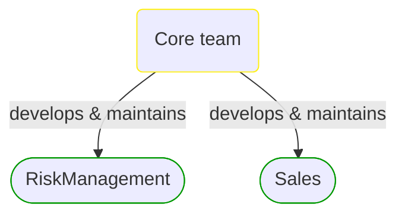
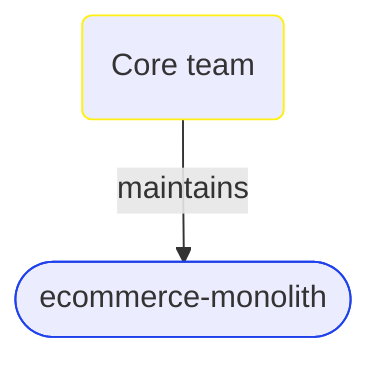


# Core team

This view contains details information about Core team team, including:
- related domain modules
- related deployable units  

---

## Domain Perspective

### Related domain modules

## Technology Perspective

### Related deployable units

## Next steps

### Zoom-out

#### People perspective

##### Cross elements

[Development teams](../Development_Teams.md)  

---

[P3 Model](https://github.com/P3-model/P3-model) documentation generated from source code using [.net tooling](https://github.com/P3-model/P3-model-dotnet)