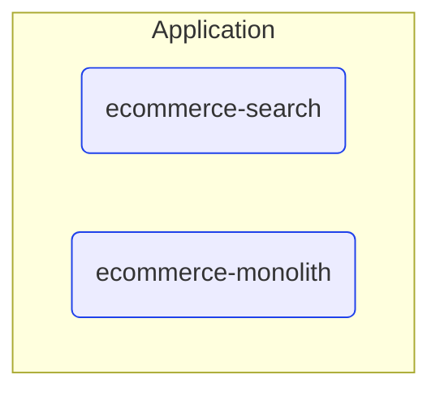

# Deployable Units

This view contains all deployable units for MyCompany e-commerce product.  

---

## Deployable units and their tires

## Next use cases

### Zoom-in

#### Technology perspective

##### Deployable Units

[ecommerce-monolith](EcommerceMonolith.md)  
[ecommerce-search](EcommerceSearch.md)  

### Zoom-out

#### Multi perspectives

[Main page](../../README.md)  

---

[P3 Model](https://github.com/P3-model/P3-model) documentation generated from source code using [.net tooling](https://github.com/P3-model/P3-model-dotnet)