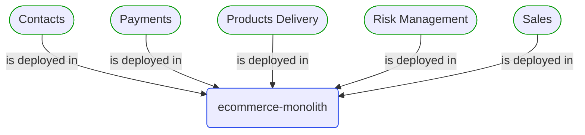
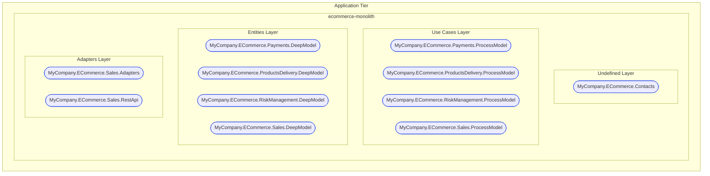
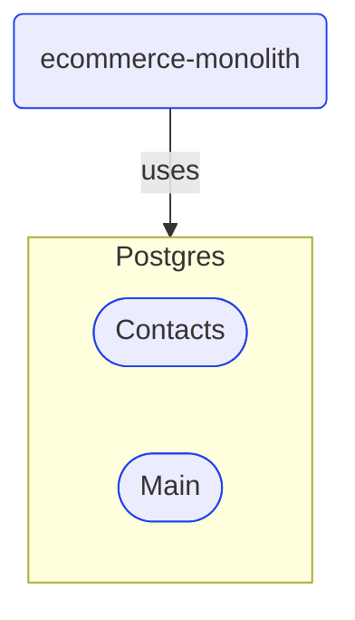


# ecommerce-monolith

***Deployable Unit***  

This view contains details information about ecommerce-monolith deployable unit, including:
- related domain modules
- related development teams  

---

## Domain Perspective

### Related domain modules

## Technology Perspective

### Tier, CSharp Projects and their Layers

### Infrastructure

## People Perspective

### Related development teams

## Next steps

### Zoom-in

#### Domain perspective

##### Domain Modules

[Contacts](../../Domain/Concepts/Contacts/Contacts.md)  
[Payments](../../Domain/Concepts/Payments/Payments.md)  
[Products delivery](../../Domain/Concepts/ProductsDelivery/ProductsDelivery.md)  
[Risk management](../../Domain/Concepts/RiskManagement/RiskManagement.md)  
[Sales](../../Domain/Concepts/Sales/Sales.md)  

#### People perspective

##### Development Teams

[Core team](../../People/DevelopmentTeams/CoreTeam.md)  
[Inventory team](../../People/DevelopmentTeams/InventoryTeam.md)  
[Supporting team](../../People/DevelopmentTeams/SupportingTeam.md)  

### Zoom-out

#### Technology perspective

[Deployable Units](DeployableUnits.md)  

---

[P3 Model](https://github.com/P3-model/P3-model) documentation generated from source code using [.net tooling](https://github.com/P3-model/P3-model-dotnet)