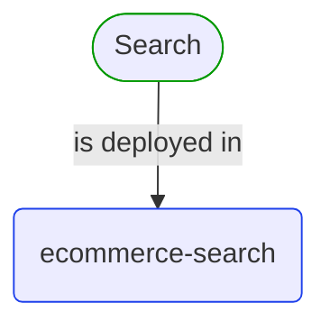
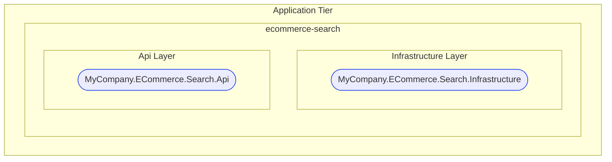
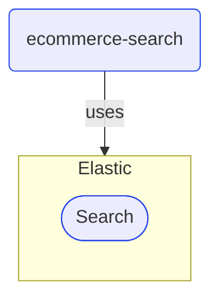
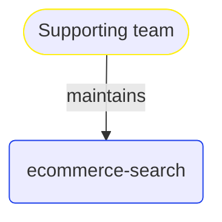


# ecommerce-search

***Deployable Unit***  

This view contains details information about ecommerce-search deployable unit, including:
- related domain modules
- related development teams  

---

## Domain Perspective

### Related domain modules

## Technology Perspective

### Tier, CSharp Projects and their Layers

### Infrastructure

## People Perspective

### Related development teams

## Next use cases

### Zoom-in

#### Domain perspective

##### Domain Modules

[Search](../../Domain/Modules/Search/Search-module.md)  

#### People perspective

##### Development Teams

[Supporting team](../../People/DevelopmentTeams/SupportingTeam.md)  

### Zoom-out

#### Technology perspective

[Deployable Units](DeployableUnits.md)  

---

[P3 Model](https://github.com/P3-model/P3-model) documentation generated from source code using [.net tooling](https://github.com/P3-model/P3-model-dotnet)